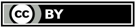

####################
Regolamento per il commercio su aree pubbliche del Comune di Palermo.
####################

.. figure:: img/palermo.PNG

Fonte: `Regolamento comunale <https://www.comune.palermo.it/js/server/normative/_24122012094346.pdf>`_.

+-------------------------------------------------------------------------------------------------------------------------------+
| **Informazioni ulteriori**                                                                                                    |
+-------------------------------------------------------------------------------------------------------------------------------+
| - Portale `Regolamenti <https://www.comune.palermo.it/regolamenti.php>`_ del Comune di Palermo                                |
|                                                                                                                               |
| - `Carta dei Servizi comunali di Palermo <https://www.comune.palermo.it/amministrazione_trasparente.php?sel=16&asel=72>`_     |
+-------------------------------------------------------------------------------------------------------------------------------+

Quest'opera è distribuita con `Licenza CC BY 4.0 <https://creativecommons.org/licenses/by/4.0/deed.it>`_ - Creative Commons,  Attribuzione, versione 4.0 Internazionale, in coerenza con la sezione `Licenze delle Linee Guida Nazionali per la Valorizzazione del Patrimonio Informativo Pubblico, dell'AgID <http://lg-patrimonio-pubblico.readthedocs.io/it/latest/licenzecosti.html?highlight=licenze#licenze>`_.

|

Testo del Regolamento 
==========================

.. toctree::

   _docs/capo1.rst
   _docs/capo2.rst
   _docs/capo3.rst
   _docs/capo4.rst
   _docs/parteseconda.rst
